# Understanding, Modeling, and Correcting Low-quality Retinal Fundus Images for Clinical Observation and Analysis

[Ziyi Shen](https://sites.google.com/site/ziyishenmi/), [Huazhu Fu](https://hzfu.github.io/), [Jianbin Shen](http://iitlab.bit.edu.cn/mcislab/~shenjianbing/), and [Ling Shao](https://scholar.google.com/citations?user=z84rLjoAAAAJ&hl=en)

**Retinal fundus image dataset**:rocket::rocket::rocket:

In this work, we analyze the ophthalmoscope imaging system and model the reliable degradation of major inferior-quality factors, including uneven illumination, blur, and artifacts.

**Fundus image correction algorithm** :thought_balloon::thought_balloon::thought_balloon:

Based on the proposed realistic degradation model, a clinical-oriented fundus correction network (Cofe-Net) is proposed to suppress the global degradation factors, and simulataneously preserve anatomical retinal structure and pathological characteristics for clinical observation and analysis.
This algorithm is able to effectively corrects low-quality fundus images without losing retinal details, and benefits medical image analysis applications, e.g., retinal vessel segmentatio and optic disc/cup detection.

Here we will release the code of our degradation algorithm and corresponding parameters for low-quality fundus image generation.
You also could refer to your own requirement and simulate specific images by setting your own data. 

The code of our Cofe-Net will also be released soon.

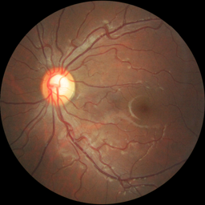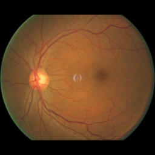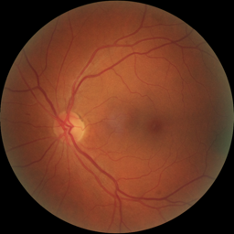 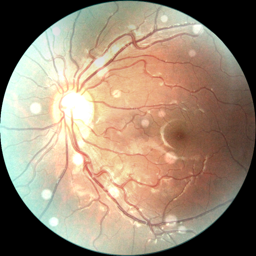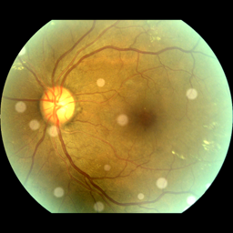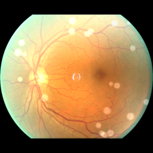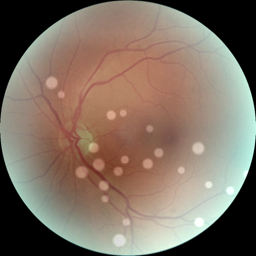

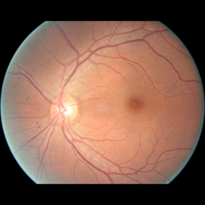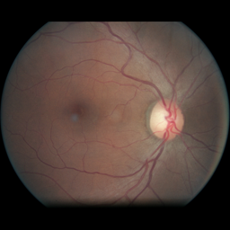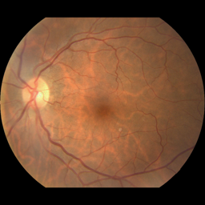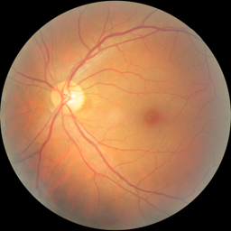 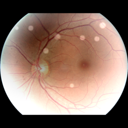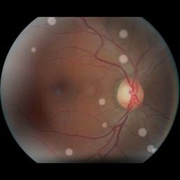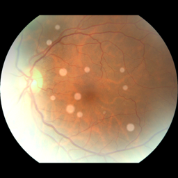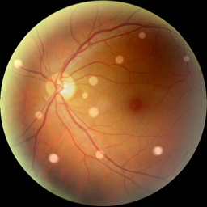
